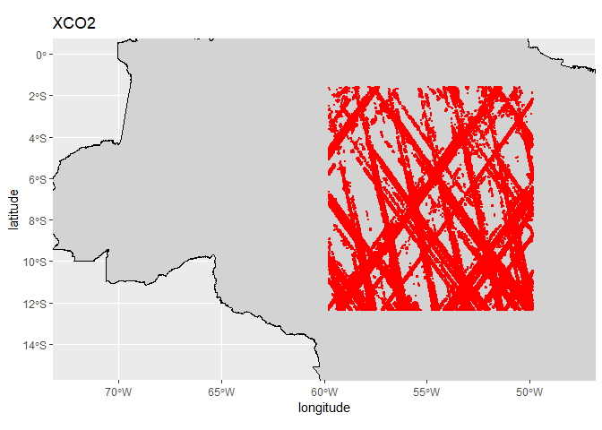
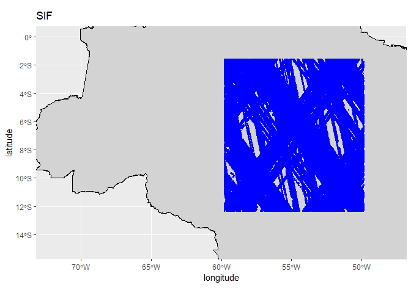

<!-- README.md is generated from README.Rmd. Please edit that file -->

# Projeto Mestrado - Rodrigo Perim

## 👨‍🔬 Autores

- **Rodrigo Baratiere Perim**  
  Mestrando em Agronomia (Ciência do Solo) - FCAV/Unesp  
  Email: [odrigo.perim@unesp.br](mailto:rodrigo.perim@unesp.br)

- **Prof. Dr. Alan Rodrigo Panosso**  
  Coorientador — Departamento de Ciências Exatas - FCAV/Unesp  
  Email: <alan.panosso@unesp.br>

## 📁 Etapas do Projeto

### ⬇️ Aquisição dos dados brutos

- **Aquisição e download dos dados brutos** [OCO-2 e
  OCO-3](https://disc.gsfc.nasa.gov):

### 🔗 Links para Download dos dados compilados:

| Dados Processados Para Download |
|:--:|
| [data-set-xco2.rds](https://drive.google.com/file/d/1E6oYKw7WyBRcgLaiFlPP1-ZTXTG4QO-2/view?usp=sharing) ⬇️ |
| [data-set-sif.rds](https://drive.google.com/file/d/1Tvy4T2O3YwY9sQwvHnDD3sZWkoqvwZbw/view?usp=sharing) ⬇️ |
| [faxina-de-dados.R](https://raw.githubusercontent.com/arpanosso/projeto-mestrado-perim/refs/heads/master/data-raw/faxina-de-dados.R) |

Formato dos arquivos:

> .rds (formato nativo do R para carregamento rápido)

> salve os arquivos na pasta `data` do projeto

### 🧹 Faxina de dados

#### Carregando o polígono do Brasil

``` r
country_br <- geobr::read_country(showProgress = FALSE)
```

#### Carregando os dados

``` r
data_set_xco2 <- readr::read_rds("data/data-set-xco2.rds") |> 
  dplyr::filter(
    longitude >=-59.7700 & longitude <= -49.8361,
    latitude >=-12.3561 & latitude <= -1.6058
  ) |> 
  dplyr::mutate(
    time = lubridate::as_datetime(time, tz = "America/Sao_Paulo"),
    year = lubridate::year(time),
    month = lubridate::month(time),
    day = lubridate::day(time),
  ) 
dplyr::glimpse(data_set_xco2)
#> Rows: 579,655
#> Columns: 10
#> $ longitude         <dbl> -54.08904, -54.24266, -54.35723, -54.36071, -54.3601…
#> $ latitude          <dbl> -8.548561, -7.880873, -7.368739, -7.360842, -7.37159…
#> $ time              <dttm> 2020-01-13 14:10:00, 2020-01-13 14:10:13, 2020-01-1…
#> $ xco2              <dbl> 412.2603, 412.8798, 413.4058, 413.8155, 414.6043, 41…
#> $ xco2_quality_flag <int> 1, 1, 1, 1, 1, 1, 1, 1, 1, 0, 1, 1, 0, 1, 1, 1, 1, 1…
#> $ xco2_incerteza    <dbl> 0.5092796, 0.4916783, 0.4935933, 0.5007727, 0.514624…
#> $ path              <chr> "data-raw/2020/OCO2/oco2_LtCO2_200113_B11210Ar_24091…
#> $ year              <dbl> 2020, 2020, 2020, 2020, 2020, 2020, 2020, 2020, 2020…
#> $ month             <dbl> 1, 1, 1, 1, 1, 1, 1, 1, 1, 1, 1, 1, 1, 1, 1, 1, 1, 1…
#> $ day               <int> 13, 13, 13, 13, 13, 13, 13, 13, 13, 13, 13, 13, 13, …
readr::write_rds(data_set_xco2,"data/data-set-xco2-filter.rds")
```

``` r
data_set_sif <- readr::read_rds("data/data-set-sif.rds") |> 
  dplyr::filter(
    longitude >=-59.7700 & longitude <= -49.8361,
    latitude >=-12.3561 & latitude <= -1.6058
  ) |>  
  dplyr::mutate(
    time = lubridate::as_datetime(time, 
                                  origin = "1990-01-01 00:00:00",
                                  tz = "America/Sao_Paulo"),
    year = lubridate::year(time),
    month = lubridate::month(time),
    day = lubridate::day(time),
  )
dplyr::glimpse(data_set_sif)
#> Rows: 2,755,525
#> Columns: 17
#> $ time               <dttm> 2020-01-02 14:27:47, 2020-01-02 14:27:58, 2020-01-…
#> $ sza                <dbl> 24.21838, 24.43658, 25.21167, 25.22522, 25.20837, 2…
#> $ vza                <dbl> 18.96948, 19.25812, 19.79761, 19.75006, 19.91901, 1…
#> $ saz                <dbl> 240.8419, 239.6188, 235.9193, 235.8642, 235.9224, 2…
#> $ vaz                <dbl> 61.69757, 59.83484, 56.50873, 56.77283, 55.88147, 5…
#> $ longitude          <dbl> -58.04297, -58.18042, -58.59381, -58.59863, -58.597…
#> $ latitude           <dbl> -12.287109, -11.691345, -9.810913, -9.781616, -9.81…
#> $ sif740             <dbl> 1.68288898, 2.33085060, 3.39827824, 3.13973331, 1.7…
#> $ sif740_uncertainty <dbl> 0.6398249, 0.5907574, 0.5819044, 0.6214972, 0.57474…
#> $ daily_sif740       <dbl> 0.60762787, 0.83928204, 1.21343613, 1.12081718, 0.6…
#> $ daily_sif757       <dbl> 0.43646145, 0.56351566, 0.39550304, 0.42863560, 0.3…
#> $ daily_sif771       <dbl> 0.24913883, 0.37035179, 0.81494141, 0.71052551, 0.3…
#> $ quality_flag       <int> 2, 2, 2, 2, 2, 2, 2, 2, 2, 2, 2, 2, 2, 2, 2, 2, 2, …
#> $ path               <chr> "data-raw/2020/OCO2 SIF/oco2_LtSIF_200102_B11012Ar_…
#> $ year               <dbl> 2020, 2020, 2020, 2020, 2020, 2020, 2020, 2020, 202…
#> $ month              <dbl> 1, 1, 1, 1, 1, 1, 1, 1, 1, 1, 1, 1, 1, 1, 1, 1, 1, …
#> $ day                <int> 2, 2, 2, 2, 2, 2, 2, 2, 2, 2, 2, 2, 2, 2, 2, 2, 2, …
readr::write_rds(data_set_sif,"data/data-set-sif-filter.rds")
```

``` r
country_br |> 
  ggplot2::ggplot()+
  ggplot2::geom_sf(fill = "lightgray", color = "black") +
  ggplot2::geom_point(data = data_set_xco2 |> 
                        dplyr::filter(year==2020),
                      ggplot2::aes(longitude, latitude),
                      size=.3,color="red") +
  # ajusta os limites do mapa
  ggplot2::coord_sf(xlim = c(-72, -48), ylim = c(-15, 0)) +
  ggplot2::labs(title = "XCO2")
```

<!-- -->

``` r
country_br |> 
  ggplot2::ggplot()+
  ggplot2::geom_sf(fill = "lightgray", color = "black") +
  ggplot2::geom_point(data = data_set_sif |> 
                        dplyr::filter(year==2020),
                      ggplot2::aes(longitude, latitude),
                      size=.3,color="blue") +
  # ajusta os limites do mapa
  ggplot2::coord_sf(xlim = c(-72, -48), ylim = c(-15, 0))+
  ggplot2::labs(title = "SIF")
```

<!-- -->
