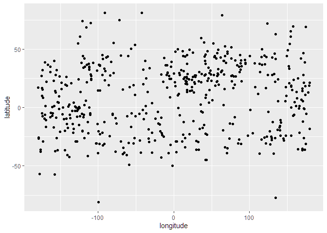
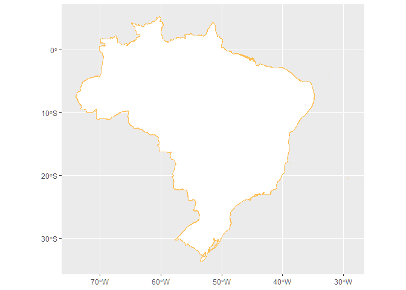
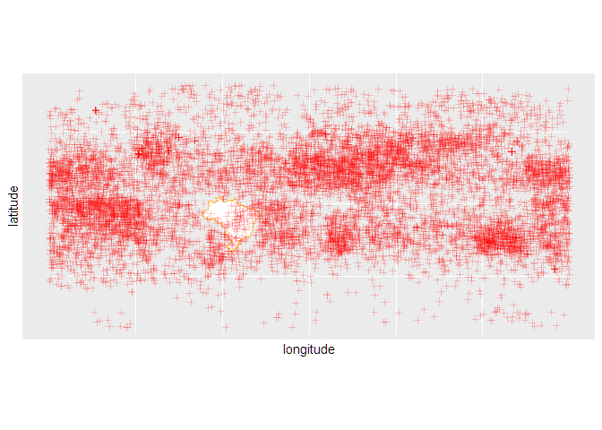

<!-- README.md is generated from README.Rmd. Please edit that file -->

# Projeto Mestrado Rodrigo Perim

## Carregando Pacotes

``` r
library(tidyverse)
library(ncdf4)
library(geobr)
```

## Ler um arquivo de dados `.NC`

``` r
# Buscar os nomes dos arquivo .nc4
list_nc4 <- list.files("data-raw/",
           recursive = TRUE,full.names = TRUE,pattern = ".nc4")

# Abrindo o1 arquivo
nc_obj <- nc_open(list_nc4[1])
#> [1] ">>>> WARNING <<<  attribute missing_value is an 8-byte value, but R"
#> [1] "does not support this data type. I am returning a double precision"
#> [1] "floating point, but you must be aware that this could lose precision!"

# buscando os nomes dos atributos no arquivo
# names(nc_obj[['var']])
```

## Função para ler um arquivo e extrair colunas de interesse

``` r
## função para ler arquivos NCD4
ncdf_reader <- function(file_path){
  nc_file <- ncdf4::nc_open(file_path)
  df <- data.frame(
    "longitude"=ncdf4::ncvar_get(nc_file,varid="longitude"),
    "latitude"=ncdf4::ncvar_get(nc_file,varid="latitude"),
    "time"=ncdf4::ncvar_get(nc_file,varid="time"),
    "xco2"=ncdf4::ncvar_get(nc_file,varid="xco2"),
    "xco2_quality_flag"=ncdf4::ncvar_get(nc_file,varid="xco2_quality_flag"),
    "xco2_incerteza"=ncdf4::ncvar_get(nc_file,varid="xco2_uncertainty"),
    "fs"=ncdf4::ncvar_get(nc_file,varid="Retrieval/fs"),
    "fs_rel"=ncdf4::ncvar_get(nc_file,varid="Retrieval/fs_rel"),
    "path" = file_path
  )
  ncdf4::nc_close(nc_file)
  return(df)
}
```

## Vamos ler todos os arquivos na pasta

``` r
# Usando a função map do dplyr
data_set <- map_df(list_nc4,ncdf_reader)
#> [1] ">>>> WARNING <<<  attribute missing_value is an 8-byte value, but R"
#> [1] "does not support this data type. I am returning a double precision"
#> [1] "floating point, but you must be aware that this could lose precision!"
#> [1] ">>>> WARNING <<<  attribute missing_value is an 8-byte value, but R"
#> [1] "does not support this data type. I am returning a double precision"
#> [1] "floating point, but you must be aware that this could lose precision!"
#> [1] ">>>> WARNING <<<  attribute missing_value is an 8-byte value, but R"
#> [1] "does not support this data type. I am returning a double precision"
#> [1] "floating point, but you must be aware that this could lose precision!"
#> [1] ">>>> WARNING <<<  attribute missing_value is an 8-byte value, but R"
#> [1] "does not support this data type. I am returning a double precision"
#> [1] "floating point, but you must be aware that this could lose precision!"
#> [1] ">>>> WARNING <<<  attribute missing_value is an 8-byte value, but R"
#> [1] "does not support this data type. I am returning a double precision"
#> [1] "floating point, but you must be aware that this could lose precision!"
#> [1] ">>>> WARNING <<<  attribute missing_value is an 8-byte value, but R"
#> [1] "does not support this data type. I am returning a double precision"
#> [1] "floating point, but you must be aware that this could lose precision!"
#> [1] ">>>> WARNING <<<  attribute missing_value is an 8-byte value, but R"
#> [1] "does not support this data type. I am returning a double precision"
#> [1] "floating point, but you must be aware that this could lose precision!"
#> [1] ">>>> WARNING <<<  attribute missing_value is an 8-byte value, but R"
#> [1] "does not support this data type. I am returning a double precision"
#> [1] "floating point, but you must be aware that this could lose precision!"
#> [1] ">>>> WARNING <<<  attribute missing_value is an 8-byte value, but R"
#> [1] "does not support this data type. I am returning a double precision"
#> [1] "floating point, but you must be aware that this could lose precision!"
#> [1] ">>>> WARNING <<<  attribute missing_value is an 8-byte value, but R"
#> [1] "does not support this data type. I am returning a double precision"
#> [1] "floating point, but you must be aware that this could lose precision!"
#> [1] ">>>> WARNING <<<  attribute missing_value is an 8-byte value, but R"
#> [1] "does not support this data type. I am returning a double precision"
#> [1] "floating point, but you must be aware that this could lose precision!"
#> [1] ">>>> WARNING <<<  attribute missing_value is an 8-byte value, but R"
#> [1] "does not support this data type. I am returning a double precision"
#> [1] "floating point, but you must be aware that this could lose precision!"
#> [1] ">>>> WARNING <<<  attribute missing_value is an 8-byte value, but R"
#> [1] "does not support this data type. I am returning a double precision"
#> [1] "floating point, but you must be aware that this could lose precision!"
#> [1] ">>>> WARNING <<<  attribute missing_value is an 8-byte value, but R"
#> [1] "does not support this data type. I am returning a double precision"
#> [1] "floating point, but you must be aware that this could lose precision!"
#> [1] ">>>> WARNING <<<  attribute missing_value is an 8-byte value, but R"
#> [1] "does not support this data type. I am returning a double precision"
#> [1] "floating point, but you must be aware that this could lose precision!"
#> [1] ">>>> WARNING <<<  attribute missing_value is an 8-byte value, but R"
#> [1] "does not support this data type. I am returning a double precision"
#> [1] "floating point, but you must be aware that this could lose precision!"
#> [1] ">>>> WARNING <<<  attribute missing_value is an 8-byte value, but R"
#> [1] "does not support this data type. I am returning a double precision"
#> [1] "floating point, but you must be aware that this could lose precision!"
#> [1] ">>>> WARNING <<<  attribute missing_value is an 8-byte value, but R"
#> [1] "does not support this data type. I am returning a double precision"
#> [1] "floating point, but you must be aware that this could lose precision!"
#> [1] ">>>> WARNING <<<  attribute missing_value is an 8-byte value, but R"
#> [1] "does not support this data type. I am returning a double precision"
#> [1] "floating point, but you must be aware that this could lose precision!"
#> [1] ">>>> WARNING <<<  attribute missing_value is an 8-byte value, but R"
#> [1] "does not support this data type. I am returning a double precision"
#> [1] "floating point, but you must be aware that this could lose precision!"
#> [1] ">>>> WARNING <<<  attribute missing_value is an 8-byte value, but R"
#> [1] "does not support this data type. I am returning a double precision"
#> [1] "floating point, but you must be aware that this could lose precision!"
#> [1] ">>>> WARNING <<<  attribute missing_value is an 8-byte value, but R"
#> [1] "does not support this data type. I am returning a double precision"
#> [1] "floating point, but you must be aware that this could lose precision!"
#> [1] ">>>> WARNING <<<  attribute missing_value is an 8-byte value, but R"
#> [1] "does not support this data type. I am returning a double precision"
#> [1] "floating point, but you must be aware that this could lose precision!"
#> [1] ">>>> WARNING <<<  attribute missing_value is an 8-byte value, but R"
#> [1] "does not support this data type. I am returning a double precision"
#> [1] "floating point, but you must be aware that this could lose precision!"
#> [1] ">>>> WARNING <<<  attribute missing_value is an 8-byte value, but R"
#> [1] "does not support this data type. I am returning a double precision"
#> [1] "floating point, but you must be aware that this could lose precision!"
#> [1] ">>>> WARNING <<<  attribute missing_value is an 8-byte value, but R"
#> [1] "does not support this data type. I am returning a double precision"
#> [1] "floating point, but you must be aware that this could lose precision!"
#> [1] ">>>> WARNING <<<  attribute missing_value is an 8-byte value, but R"
#> [1] "does not support this data type. I am returning a double precision"
#> [1] "floating point, but you must be aware that this could lose precision!"
#> [1] ">>>> WARNING <<<  attribute missing_value is an 8-byte value, but R"
#> [1] "does not support this data type. I am returning a double precision"
#> [1] "floating point, but you must be aware that this could lose precision!"
#> [1] ">>>> WARNING <<<  attribute missing_value is an 8-byte value, but R"
#> [1] "does not support this data type. I am returning a double precision"
#> [1] "floating point, but you must be aware that this could lose precision!"
#> [1] ">>>> WARNING <<<  attribute missing_value is an 8-byte value, but R"
#> [1] "does not support this data type. I am returning a double precision"
#> [1] "floating point, but you must be aware that this could lose precision!"
#> [1] ">>>> WARNING <<<  attribute missing_value is an 8-byte value, but R"
#> [1] "does not support this data type. I am returning a double precision"
#> [1] "floating point, but you must be aware that this could lose precision!"
#> [1] ">>>> WARNING <<<  attribute missing_value is an 8-byte value, but R"
#> [1] "does not support this data type. I am returning a double precision"
#> [1] "floating point, but you must be aware that this could lose precision!"
#> [1] ">>>> WARNING <<<  attribute missing_value is an 8-byte value, but R"
#> [1] "does not support this data type. I am returning a double precision"
#> [1] "floating point, but you must be aware that this could lose precision!"
#> [1] ">>>> WARNING <<<  attribute missing_value is an 8-byte value, but R"
#> [1] "does not support this data type. I am returning a double precision"
#> [1] "floating point, but you must be aware that this could lose precision!"
#> [1] ">>>> WARNING <<<  attribute missing_value is an 8-byte value, but R"
#> [1] "does not support this data type. I am returning a double precision"
#> [1] "floating point, but you must be aware that this could lose precision!"
#> [1] ">>>> WARNING <<<  attribute missing_value is an 8-byte value, but R"
#> [1] "does not support this data type. I am returning a double precision"
#> [1] "floating point, but you must be aware that this could lose precision!"
#> [1] ">>>> WARNING <<<  attribute missing_value is an 8-byte value, but R"
#> [1] "does not support this data type. I am returning a double precision"
#> [1] "floating point, but you must be aware that this could lose precision!"
#> [1] ">>>> WARNING <<<  attribute missing_value is an 8-byte value, but R"
#> [1] "does not support this data type. I am returning a double precision"
#> [1] "floating point, but you must be aware that this could lose precision!"
#> [1] ">>>> WARNING <<<  attribute missing_value is an 8-byte value, but R"
#> [1] "does not support this data type. I am returning a double precision"
#> [1] "floating point, but you must be aware that this could lose precision!"
#> [1] ">>>> WARNING <<<  attribute missing_value is an 8-byte value, but R"
#> [1] "does not support this data type. I am returning a double precision"
#> [1] "floating point, but you must be aware that this could lose precision!"
#> [1] ">>>> WARNING <<<  attribute missing_value is an 8-byte value, but R"
#> [1] "does not support this data type. I am returning a double precision"
#> [1] "floating point, but you must be aware that this could lose precision!"
#> [1] ">>>> WARNING <<<  attribute missing_value is an 8-byte value, but R"
#> [1] "does not support this data type. I am returning a double precision"
#> [1] "floating point, but you must be aware that this could lose precision!"
#> [1] ">>>> WARNING <<<  attribute missing_value is an 8-byte value, but R"
#> [1] "does not support this data type. I am returning a double precision"
#> [1] "floating point, but you must be aware that this could lose precision!"
#> [1] ">>>> WARNING <<<  attribute missing_value is an 8-byte value, but R"
#> [1] "does not support this data type. I am returning a double precision"
#> [1] "floating point, but you must be aware that this could lose precision!"
#> [1] ">>>> WARNING <<<  attribute missing_value is an 8-byte value, but R"
#> [1] "does not support this data type. I am returning a double precision"
#> [1] "floating point, but you must be aware that this could lose precision!"
#> [1] ">>>> WARNING <<<  attribute missing_value is an 8-byte value, but R"
#> [1] "does not support this data type. I am returning a double precision"
#> [1] "floating point, but you must be aware that this could lose precision!"
#> [1] ">>>> WARNING <<<  attribute missing_value is an 8-byte value, but R"
#> [1] "does not support this data type. I am returning a double precision"
#> [1] "floating point, but you must be aware that this could lose precision!"
#> [1] ">>>> WARNING <<<  attribute missing_value is an 8-byte value, but R"
#> [1] "does not support this data type. I am returning a double precision"
#> [1] "floating point, but you must be aware that this could lose precision!"
#> [1] ">>>> WARNING <<<  attribute missing_value is an 8-byte value, but R"
#> [1] "does not support this data type. I am returning a double precision"
#> [1] "floating point, but you must be aware that this could lose precision!"
#> [1] ">>>> WARNING <<<  attribute missing_value is an 8-byte value, but R"
#> [1] "does not support this data type. I am returning a double precision"
#> [1] "floating point, but you must be aware that this could lose precision!"
#> [1] ">>>> WARNING <<<  attribute missing_value is an 8-byte value, but R"
#> [1] "does not support this data type. I am returning a double precision"
#> [1] "floating point, but you must be aware that this could lose precision!"
#> [1] ">>>> WARNING <<<  attribute missing_value is an 8-byte value, but R"
#> [1] "does not support this data type. I am returning a double precision"
#> [1] "floating point, but you must be aware that this could lose precision!"
#> [1] ">>>> WARNING <<<  attribute missing_value is an 8-byte value, but R"
#> [1] "does not support this data type. I am returning a double precision"
#> [1] "floating point, but you must be aware that this could lose precision!"
#> [1] ">>>> WARNING <<<  attribute missing_value is an 8-byte value, but R"
#> [1] "does not support this data type. I am returning a double precision"
#> [1] "floating point, but you must be aware that this could lose precision!"
#> [1] ">>>> WARNING <<<  attribute missing_value is an 8-byte value, but R"
#> [1] "does not support this data type. I am returning a double precision"
#> [1] "floating point, but you must be aware that this could lose precision!"
#> [1] ">>>> WARNING <<<  attribute missing_value is an 8-byte value, but R"
#> [1] "does not support this data type. I am returning a double precision"
#> [1] "floating point, but you must be aware that this could lose precision!"
#> [1] ">>>> WARNING <<<  attribute missing_value is an 8-byte value, but R"
#> [1] "does not support this data type. I am returning a double precision"
#> [1] "floating point, but you must be aware that this could lose precision!"
#> [1] ">>>> WARNING <<<  attribute missing_value is an 8-byte value, but R"
#> [1] "does not support this data type. I am returning a double precision"
#> [1] "floating point, but you must be aware that this could lose precision!"
#> [1] ">>>> WARNING <<<  attribute missing_value is an 8-byte value, but R"
#> [1] "does not support this data type. I am returning a double precision"
#> [1] "floating point, but you must be aware that this could lose precision!"
#> [1] ">>>> WARNING <<<  attribute missing_value is an 8-byte value, but R"
#> [1] "does not support this data type. I am returning a double precision"
#> [1] "floating point, but you must be aware that this could lose precision!"
#> [1] ">>>> WARNING <<<  attribute missing_value is an 8-byte value, but R"
#> [1] "does not support this data type. I am returning a double precision"
#> [1] "floating point, but you must be aware that this could lose precision!"
#> [1] ">>>> WARNING <<<  attribute missing_value is an 8-byte value, but R"
#> [1] "does not support this data type. I am returning a double precision"
#> [1] "floating point, but you must be aware that this could lose precision!"
#> [1] ">>>> WARNING <<<  attribute missing_value is an 8-byte value, but R"
#> [1] "does not support this data type. I am returning a double precision"
#> [1] "floating point, but you must be aware that this could lose precision!"
#> [1] ">>>> WARNING <<<  attribute missing_value is an 8-byte value, but R"
#> [1] "does not support this data type. I am returning a double precision"
#> [1] "floating point, but you must be aware that this could lose precision!"
#> [1] ">>>> WARNING <<<  attribute missing_value is an 8-byte value, but R"
#> [1] "does not support this data type. I am returning a double precision"
#> [1] "floating point, but you must be aware that this could lose precision!"
#> [1] ">>>> WARNING <<<  attribute missing_value is an 8-byte value, but R"
#> [1] "does not support this data type. I am returning a double precision"
#> [1] "floating point, but you must be aware that this could lose precision!"
#> [1] ">>>> WARNING <<<  attribute missing_value is an 8-byte value, but R"
#> [1] "does not support this data type. I am returning a double precision"
#> [1] "floating point, but you must be aware that this could lose precision!"
#> [1] ">>>> WARNING <<<  attribute missing_value is an 8-byte value, but R"
#> [1] "does not support this data type. I am returning a double precision"
#> [1] "floating point, but you must be aware that this could lose precision!"
#> [1] ">>>> WARNING <<<  attribute missing_value is an 8-byte value, but R"
#> [1] "does not support this data type. I am returning a double precision"
#> [1] "floating point, but you must be aware that this could lose precision!"
#> [1] ">>>> WARNING <<<  attribute missing_value is an 8-byte value, but R"
#> [1] "does not support this data type. I am returning a double precision"
#> [1] "floating point, but you must be aware that this could lose precision!"
#> [1] ">>>> WARNING <<<  attribute missing_value is an 8-byte value, but R"
#> [1] "does not support this data type. I am returning a double precision"
#> [1] "floating point, but you must be aware that this could lose precision!"
#> [1] ">>>> WARNING <<<  attribute missing_value is an 8-byte value, but R"
#> [1] "does not support this data type. I am returning a double precision"
#> [1] "floating point, but you must be aware that this could lose precision!"
#> [1] ">>>> WARNING <<<  attribute missing_value is an 8-byte value, but R"
#> [1] "does not support this data type. I am returning a double precision"
#> [1] "floating point, but you must be aware that this could lose precision!"
#> [1] ">>>> WARNING <<<  attribute missing_value is an 8-byte value, but R"
#> [1] "does not support this data type. I am returning a double precision"
#> [1] "floating point, but you must be aware that this could lose precision!"
#> [1] ">>>> WARNING <<<  attribute missing_value is an 8-byte value, but R"
#> [1] "does not support this data type. I am returning a double precision"
#> [1] "floating point, but you must be aware that this could lose precision!"
#> [1] ">>>> WARNING <<<  attribute missing_value is an 8-byte value, but R"
#> [1] "does not support this data type. I am returning a double precision"
#> [1] "floating point, but you must be aware that this could lose precision!"
#> [1] ">>>> WARNING <<<  attribute missing_value is an 8-byte value, but R"
#> [1] "does not support this data type. I am returning a double precision"
#> [1] "floating point, but you must be aware that this could lose precision!"
#> [1] ">>>> WARNING <<<  attribute missing_value is an 8-byte value, but R"
#> [1] "does not support this data type. I am returning a double precision"
#> [1] "floating point, but you must be aware that this could lose precision!"
#> [1] ">>>> WARNING <<<  attribute missing_value is an 8-byte value, but R"
#> [1] "does not support this data type. I am returning a double precision"
#> [1] "floating point, but you must be aware that this could lose precision!"
#> [1] ">>>> WARNING <<<  attribute missing_value is an 8-byte value, but R"
#> [1] "does not support this data type. I am returning a double precision"
#> [1] "floating point, but you must be aware that this could lose precision!"
#> [1] ">>>> WARNING <<<  attribute missing_value is an 8-byte value, but R"
#> [1] "does not support this data type. I am returning a double precision"
#> [1] "floating point, but you must be aware that this could lose precision!"
#> [1] ">>>> WARNING <<<  attribute missing_value is an 8-byte value, but R"
#> [1] "does not support this data type. I am returning a double precision"
#> [1] "floating point, but you must be aware that this could lose precision!"
#> [1] ">>>> WARNING <<<  attribute missing_value is an 8-byte value, but R"
#> [1] "does not support this data type. I am returning a double precision"
#> [1] "floating point, but you must be aware that this could lose precision!"
#> [1] ">>>> WARNING <<<  attribute missing_value is an 8-byte value, but R"
#> [1] "does not support this data type. I am returning a double precision"
#> [1] "floating point, but you must be aware that this could lose precision!"
#> [1] ">>>> WARNING <<<  attribute missing_value is an 8-byte value, but R"
#> [1] "does not support this data type. I am returning a double precision"
#> [1] "floating point, but you must be aware that this could lose precision!"
#> [1] ">>>> WARNING <<<  attribute missing_value is an 8-byte value, but R"
#> [1] "does not support this data type. I am returning a double precision"
#> [1] "floating point, but you must be aware that this could lose precision!"
#> [1] ">>>> WARNING <<<  attribute missing_value is an 8-byte value, but R"
#> [1] "does not support this data type. I am returning a double precision"
#> [1] "floating point, but you must be aware that this could lose precision!"
#> [1] ">>>> WARNING <<<  attribute missing_value is an 8-byte value, but R"
#> [1] "does not support this data type. I am returning a double precision"
#> [1] "floating point, but you must be aware that this could lose precision!"
#> [1] ">>>> WARNING <<<  attribute missing_value is an 8-byte value, but R"
#> [1] "does not support this data type. I am returning a double precision"
#> [1] "floating point, but you must be aware that this could lose precision!"
#> [1] ">>>> WARNING <<<  attribute missing_value is an 8-byte value, but R"
#> [1] "does not support this data type. I am returning a double precision"
#> [1] "floating point, but you must be aware that this could lose precision!"
#> [1] ">>>> WARNING <<<  attribute missing_value is an 8-byte value, but R"
#> [1] "does not support this data type. I am returning a double precision"
#> [1] "floating point, but you must be aware that this could lose precision!"
#> [1] ">>>> WARNING <<<  attribute missing_value is an 8-byte value, but R"
#> [1] "does not support this data type. I am returning a double precision"
#> [1] "floating point, but you must be aware that this could lose precision!"
#> [1] ">>>> WARNING <<<  attribute missing_value is an 8-byte value, but R"
#> [1] "does not support this data type. I am returning a double precision"
#> [1] "floating point, but you must be aware that this could lose precision!"
#> [1] ">>>> WARNING <<<  attribute missing_value is an 8-byte value, but R"
#> [1] "does not support this data type. I am returning a double precision"
#> [1] "floating point, but you must be aware that this could lose precision!"
#> [1] ">>>> WARNING <<<  attribute missing_value is an 8-byte value, but R"
#> [1] "does not support this data type. I am returning a double precision"
#> [1] "floating point, but you must be aware that this could lose precision!"
#> [1] ">>>> WARNING <<<  attribute missing_value is an 8-byte value, but R"
#> [1] "does not support this data type. I am returning a double precision"
#> [1] "floating point, but you must be aware that this could lose precision!"
#> [1] ">>>> WARNING <<<  attribute missing_value is an 8-byte value, but R"
#> [1] "does not support this data type. I am returning a double precision"
#> [1] "floating point, but you must be aware that this could lose precision!"
#> [1] ">>>> WARNING <<<  attribute missing_value is an 8-byte value, but R"
#> [1] "does not support this data type. I am returning a double precision"
#> [1] "floating point, but you must be aware that this could lose precision!"
#> [1] ">>>> WARNING <<<  attribute missing_value is an 8-byte value, but R"
#> [1] "does not support this data type. I am returning a double precision"
#> [1] "floating point, but you must be aware that this could lose precision!"
#> [1] ">>>> WARNING <<<  attribute missing_value is an 8-byte value, but R"
#> [1] "does not support this data type. I am returning a double precision"
#> [1] "floating point, but you must be aware that this could lose precision!"
#> [1] ">>>> WARNING <<<  attribute missing_value is an 8-byte value, but R"
#> [1] "does not support this data type. I am returning a double precision"
#> [1] "floating point, but you must be aware that this could lose precision!"
#> [1] ">>>> WARNING <<<  attribute missing_value is an 8-byte value, but R"
#> [1] "does not support this data type. I am returning a double precision"
#> [1] "floating point, but you must be aware that this could lose precision!"
#> [1] ">>>> WARNING <<<  attribute missing_value is an 8-byte value, but R"
#> [1] "does not support this data type. I am returning a double precision"
#> [1] "floating point, but you must be aware that this could lose precision!"
#> [1] ">>>> WARNING <<<  attribute missing_value is an 8-byte value, but R"
#> [1] "does not support this data type. I am returning a double precision"
#> [1] "floating point, but you must be aware that this could lose precision!"
#> [1] ">>>> WARNING <<<  attribute missing_value is an 8-byte value, but R"
#> [1] "does not support this data type. I am returning a double precision"
#> [1] "floating point, but you must be aware that this could lose precision!"
#> [1] ">>>> WARNING <<<  attribute missing_value is an 8-byte value, but R"
#> [1] "does not support this data type. I am returning a double precision"
#> [1] "floating point, but you must be aware that this could lose precision!"
#> [1] ">>>> WARNING <<<  attribute missing_value is an 8-byte value, but R"
#> [1] "does not support this data type. I am returning a double precision"
#> [1] "floating point, but you must be aware that this could lose precision!"
#> [1] ">>>> WARNING <<<  attribute missing_value is an 8-byte value, but R"
#> [1] "does not support this data type. I am returning a double precision"
#> [1] "floating point, but you must be aware that this could lose precision!"
#> [1] ">>>> WARNING <<<  attribute missing_value is an 8-byte value, but R"
#> [1] "does not support this data type. I am returning a double precision"
#> [1] "floating point, but you must be aware that this could lose precision!"
#> [1] ">>>> WARNING <<<  attribute missing_value is an 8-byte value, but R"
#> [1] "does not support this data type. I am returning a double precision"
#> [1] "floating point, but you must be aware that this could lose precision!"
#> [1] ">>>> WARNING <<<  attribute missing_value is an 8-byte value, but R"
#> [1] "does not support this data type. I am returning a double precision"
#> [1] "floating point, but you must be aware that this could lose precision!"
#> [1] ">>>> WARNING <<<  attribute missing_value is an 8-byte value, but R"
#> [1] "does not support this data type. I am returning a double precision"
#> [1] "floating point, but you must be aware that this could lose precision!"
#> [1] ">>>> WARNING <<<  attribute missing_value is an 8-byte value, but R"
#> [1] "does not support this data type. I am returning a double precision"
#> [1] "floating point, but you must be aware that this could lose precision!"
#> [1] ">>>> WARNING <<<  attribute missing_value is an 8-byte value, but R"
#> [1] "does not support this data type. I am returning a double precision"
#> [1] "floating point, but you must be aware that this could lose precision!"
#> [1] ">>>> WARNING <<<  attribute missing_value is an 8-byte value, but R"
#> [1] "does not support this data type. I am returning a double precision"
#> [1] "floating point, but you must be aware that this could lose precision!"
#> [1] ">>>> WARNING <<<  attribute missing_value is an 8-byte value, but R"
#> [1] "does not support this data type. I am returning a double precision"
#> [1] "floating point, but you must be aware that this could lose precision!"
#> [1] ">>>> WARNING <<<  attribute missing_value is an 8-byte value, but R"
#> [1] "does not support this data type. I am returning a double precision"
#> [1] "floating point, but you must be aware that this could lose precision!"
#> [1] ">>>> WARNING <<<  attribute missing_value is an 8-byte value, but R"
#> [1] "does not support this data type. I am returning a double precision"
#> [1] "floating point, but you must be aware that this could lose precision!"
#> [1] ">>>> WARNING <<<  attribute missing_value is an 8-byte value, but R"
#> [1] "does not support this data type. I am returning a double precision"
#> [1] "floating point, but you must be aware that this could lose precision!"
#> [1] ">>>> WARNING <<<  attribute missing_value is an 8-byte value, but R"
#> [1] "does not support this data type. I am returning a double precision"
#> [1] "floating point, but you must be aware that this could lose precision!"
#> [1] ">>>> WARNING <<<  attribute missing_value is an 8-byte value, but R"
#> [1] "does not support this data type. I am returning a double precision"
#> [1] "floating point, but you must be aware that this could lose precision!"
#> [1] ">>>> WARNING <<<  attribute missing_value is an 8-byte value, but R"
#> [1] "does not support this data type. I am returning a double precision"
#> [1] "floating point, but you must be aware that this could lose precision!"
#> [1] ">>>> WARNING <<<  attribute missing_value is an 8-byte value, but R"
#> [1] "does not support this data type. I am returning a double precision"
#> [1] "floating point, but you must be aware that this could lose precision!"
#> [1] ">>>> WARNING <<<  attribute missing_value is an 8-byte value, but R"
#> [1] "does not support this data type. I am returning a double precision"
#> [1] "floating point, but you must be aware that this could lose precision!"
#> [1] ">>>> WARNING <<<  attribute missing_value is an 8-byte value, but R"
#> [1] "does not support this data type. I am returning a double precision"
#> [1] "floating point, but you must be aware that this could lose precision!"
#> [1] ">>>> WARNING <<<  attribute missing_value is an 8-byte value, but R"
#> [1] "does not support this data type. I am returning a double precision"
#> [1] "floating point, but you must be aware that this could lose precision!"
#> [1] ">>>> WARNING <<<  attribute missing_value is an 8-byte value, but R"
#> [1] "does not support this data type. I am returning a double precision"
#> [1] "floating point, but you must be aware that this could lose precision!"
#> [1] ">>>> WARNING <<<  attribute missing_value is an 8-byte value, but R"
#> [1] "does not support this data type. I am returning a double precision"
#> [1] "floating point, but you must be aware that this could lose precision!"
#> [1] ">>>> WARNING <<<  attribute missing_value is an 8-byte value, but R"
#> [1] "does not support this data type. I am returning a double precision"
#> [1] "floating point, but you must be aware that this could lose precision!"
#> [1] ">>>> WARNING <<<  attribute missing_value is an 8-byte value, but R"
#> [1] "does not support this data type. I am returning a double precision"
#> [1] "floating point, but you must be aware that this could lose precision!"
#> [1] ">>>> WARNING <<<  attribute missing_value is an 8-byte value, but R"
#> [1] "does not support this data type. I am returning a double precision"
#> [1] "floating point, but you must be aware that this could lose precision!"
#> [1] ">>>> WARNING <<<  attribute missing_value is an 8-byte value, but R"
#> [1] "does not support this data type. I am returning a double precision"
#> [1] "floating point, but you must be aware that this could lose precision!"
#> [1] ">>>> WARNING <<<  attribute missing_value is an 8-byte value, but R"
#> [1] "does not support this data type. I am returning a double precision"
#> [1] "floating point, but you must be aware that this could lose precision!"
#> [1] ">>>> WARNING <<<  attribute missing_value is an 8-byte value, but R"
#> [1] "does not support this data type. I am returning a double precision"
#> [1] "floating point, but you must be aware that this could lose precision!"
#> [1] ">>>> WARNING <<<  attribute missing_value is an 8-byte value, but R"
#> [1] "does not support this data type. I am returning a double precision"
#> [1] "floating point, but you must be aware that this could lose precision!"
#> [1] ">>>> WARNING <<<  attribute missing_value is an 8-byte value, but R"
#> [1] "does not support this data type. I am returning a double precision"
#> [1] "floating point, but you must be aware that this could lose precision!"
#> [1] ">>>> WARNING <<<  attribute missing_value is an 8-byte value, but R"
#> [1] "does not support this data type. I am returning a double precision"
#> [1] "floating point, but you must be aware that this could lose precision!"
#> [1] ">>>> WARNING <<<  attribute missing_value is an 8-byte value, but R"
#> [1] "does not support this data type. I am returning a double precision"
#> [1] "floating point, but you must be aware that this could lose precision!"
#> [1] ">>>> WARNING <<<  attribute missing_value is an 8-byte value, but R"
#> [1] "does not support this data type. I am returning a double precision"
#> [1] "floating point, but you must be aware that this could lose precision!"
#> [1] ">>>> WARNING <<<  attribute missing_value is an 8-byte value, but R"
#> [1] "does not support this data type. I am returning a double precision"
#> [1] "floating point, but you must be aware that this could lose precision!"
#> [1] ">>>> WARNING <<<  attribute missing_value is an 8-byte value, but R"
#> [1] "does not support this data type. I am returning a double precision"
#> [1] "floating point, but you must be aware that this could lose precision!"
#> [1] ">>>> WARNING <<<  attribute missing_value is an 8-byte value, but R"
#> [1] "does not support this data type. I am returning a double precision"
#> [1] "floating point, but you must be aware that this could lose precision!"
#> [1] ">>>> WARNING <<<  attribute missing_value is an 8-byte value, but R"
#> [1] "does not support this data type. I am returning a double precision"
#> [1] "floating point, but you must be aware that this could lose precision!"
#> [1] ">>>> WARNING <<<  attribute missing_value is an 8-byte value, but R"
#> [1] "does not support this data type. I am returning a double precision"
#> [1] "floating point, but you must be aware that this could lose precision!"
#> [1] ">>>> WARNING <<<  attribute missing_value is an 8-byte value, but R"
#> [1] "does not support this data type. I am returning a double precision"
#> [1] "floating point, but you must be aware that this could lose precision!"
#> [1] ">>>> WARNING <<<  attribute missing_value is an 8-byte value, but R"
#> [1] "does not support this data type. I am returning a double precision"
#> [1] "floating point, but you must be aware that this could lose precision!"
#> [1] ">>>> WARNING <<<  attribute missing_value is an 8-byte value, but R"
#> [1] "does not support this data type. I am returning a double precision"
#> [1] "floating point, but you must be aware that this could lose precision!"
#> [1] ">>>> WARNING <<<  attribute missing_value is an 8-byte value, but R"
#> [1] "does not support this data type. I am returning a double precision"
#> [1] "floating point, but you must be aware that this could lose precision!"
#> [1] ">>>> WARNING <<<  attribute missing_value is an 8-byte value, but R"
#> [1] "does not support this data type. I am returning a double precision"
#> [1] "floating point, but you must be aware that this could lose precision!"
#> [1] ">>>> WARNING <<<  attribute missing_value is an 8-byte value, but R"
#> [1] "does not support this data type. I am returning a double precision"
#> [1] "floating point, but you must be aware that this could lose precision!"
#> [1] ">>>> WARNING <<<  attribute missing_value is an 8-byte value, but R"
#> [1] "does not support this data type. I am returning a double precision"
#> [1] "floating point, but you must be aware that this could lose precision!"
#> [1] ">>>> WARNING <<<  attribute missing_value is an 8-byte value, but R"
#> [1] "does not support this data type. I am returning a double precision"
#> [1] "floating point, but you must be aware that this could lose precision!"
#> [1] ">>>> WARNING <<<  attribute missing_value is an 8-byte value, but R"
#> [1] "does not support this data type. I am returning a double precision"
#> [1] "floating point, but you must be aware that this could lose precision!"
#> [1] ">>>> WARNING <<<  attribute missing_value is an 8-byte value, but R"
#> [1] "does not support this data type. I am returning a double precision"
#> [1] "floating point, but you must be aware that this could lose precision!"
#> [1] ">>>> WARNING <<<  attribute missing_value is an 8-byte value, but R"
#> [1] "does not support this data type. I am returning a double precision"
#> [1] "floating point, but you must be aware that this could lose precision!"
#> [1] ">>>> WARNING <<<  attribute missing_value is an 8-byte value, but R"
#> [1] "does not support this data type. I am returning a double precision"
#> [1] "floating point, but you must be aware that this could lose precision!"
#> [1] ">>>> WARNING <<<  attribute missing_value is an 8-byte value, but R"
#> [1] "does not support this data type. I am returning a double precision"
#> [1] "floating point, but you must be aware that this could lose precision!"
#> [1] ">>>> WARNING <<<  attribute missing_value is an 8-byte value, but R"
#> [1] "does not support this data type. I am returning a double precision"
#> [1] "floating point, but you must be aware that this could lose precision!"
#> [1] ">>>> WARNING <<<  attribute missing_value is an 8-byte value, but R"
#> [1] "does not support this data type. I am returning a double precision"
#> [1] "floating point, but you must be aware that this could lose precision!"
#> [1] ">>>> WARNING <<<  attribute missing_value is an 8-byte value, but R"
#> [1] "does not support this data type. I am returning a double precision"
#> [1] "floating point, but you must be aware that this could lose precision!"
#> [1] ">>>> WARNING <<<  attribute missing_value is an 8-byte value, but R"
#> [1] "does not support this data type. I am returning a double precision"
#> [1] "floating point, but you must be aware that this could lose precision!"
#> [1] ">>>> WARNING <<<  attribute missing_value is an 8-byte value, but R"
#> [1] "does not support this data type. I am returning a double precision"
#> [1] "floating point, but you must be aware that this could lose precision!"
#> [1] ">>>> WARNING <<<  attribute missing_value is an 8-byte value, but R"
#> [1] "does not support this data type. I am returning a double precision"
#> [1] "floating point, but you must be aware that this could lose precision!"
#> [1] ">>>> WARNING <<<  attribute missing_value is an 8-byte value, but R"
#> [1] "does not support this data type. I am returning a double precision"
#> [1] "floating point, but you must be aware that this could lose precision!"
#> [1] ">>>> WARNING <<<  attribute missing_value is an 8-byte value, but R"
#> [1] "does not support this data type. I am returning a double precision"
#> [1] "floating point, but you must be aware that this could lose precision!"
#> [1] ">>>> WARNING <<<  attribute missing_value is an 8-byte value, but R"
#> [1] "does not support this data type. I am returning a double precision"
#> [1] "floating point, but you must be aware that this could lose precision!"
#> [1] ">>>> WARNING <<<  attribute missing_value is an 8-byte value, but R"
#> [1] "does not support this data type. I am returning a double precision"
#> [1] "floating point, but you must be aware that this could lose precision!"
#> [1] ">>>> WARNING <<<  attribute missing_value is an 8-byte value, but R"
#> [1] "does not support this data type. I am returning a double precision"
#> [1] "floating point, but you must be aware that this could lose precision!"
#> [1] ">>>> WARNING <<<  attribute missing_value is an 8-byte value, but R"
#> [1] "does not support this data type. I am returning a double precision"
#> [1] "floating point, but you must be aware that this could lose precision!"
#> [1] ">>>> WARNING <<<  attribute missing_value is an 8-byte value, but R"
#> [1] "does not support this data type. I am returning a double precision"
#> [1] "floating point, but you must be aware that this could lose precision!"
#> [1] ">>>> WARNING <<<  attribute missing_value is an 8-byte value, but R"
#> [1] "does not support this data type. I am returning a double precision"
#> [1] "floating point, but you must be aware that this could lose precision!"
#> [1] ">>>> WARNING <<<  attribute missing_value is an 8-byte value, but R"
#> [1] "does not support this data type. I am returning a double precision"
#> [1] "floating point, but you must be aware that this could lose precision!"
#> [1] ">>>> WARNING <<<  attribute missing_value is an 8-byte value, but R"
#> [1] "does not support this data type. I am returning a double precision"
#> [1] "floating point, but you must be aware that this could lose precision!"
#> [1] ">>>> WARNING <<<  attribute missing_value is an 8-byte value, but R"
#> [1] "does not support this data type. I am returning a double precision"
#> [1] "floating point, but you must be aware that this could lose precision!"
#> [1] ">>>> WARNING <<<  attribute missing_value is an 8-byte value, but R"
#> [1] "does not support this data type. I am returning a double precision"
#> [1] "floating point, but you must be aware that this could lose precision!"
#> [1] ">>>> WARNING <<<  attribute missing_value is an 8-byte value, but R"
#> [1] "does not support this data type. I am returning a double precision"
#> [1] "floating point, but you must be aware that this could lose precision!"
#> [1] ">>>> WARNING <<<  attribute missing_value is an 8-byte value, but R"
#> [1] "does not support this data type. I am returning a double precision"
#> [1] "floating point, but you must be aware that this could lose precision!"
#> [1] ">>>> WARNING <<<  attribute missing_value is an 8-byte value, but R"
#> [1] "does not support this data type. I am returning a double precision"
#> [1] "floating point, but you must be aware that this could lose precision!"
#> [1] ">>>> WARNING <<<  attribute missing_value is an 8-byte value, but R"
#> [1] "does not support this data type. I am returning a double precision"
#> [1] "floating point, but you must be aware that this could lose precision!"
#> [1] ">>>> WARNING <<<  attribute missing_value is an 8-byte value, but R"
#> [1] "does not support this data type. I am returning a double precision"
#> [1] "floating point, but you must be aware that this could lose precision!"
#> [1] ">>>> WARNING <<<  attribute missing_value is an 8-byte value, but R"
#> [1] "does not support this data type. I am returning a double precision"
#> [1] "floating point, but you must be aware that this could lose precision!"
#> [1] ">>>> WARNING <<<  attribute missing_value is an 8-byte value, but R"
#> [1] "does not support this data type. I am returning a double precision"
#> [1] "floating point, but you must be aware that this could lose precision!"
#> [1] ">>>> WARNING <<<  attribute missing_value is an 8-byte value, but R"
#> [1] "does not support this data type. I am returning a double precision"
#> [1] "floating point, but you must be aware that this could lose precision!"
#> [1] ">>>> WARNING <<<  attribute missing_value is an 8-byte value, but R"
#> [1] "does not support this data type. I am returning a double precision"
#> [1] "floating point, but you must be aware that this could lose precision!"
#> [1] ">>>> WARNING <<<  attribute missing_value is an 8-byte value, but R"
#> [1] "does not support this data type. I am returning a double precision"
#> [1] "floating point, but you must be aware that this could lose precision!"
#> [1] ">>>> WARNING <<<  attribute missing_value is an 8-byte value, but R"
#> [1] "does not support this data type. I am returning a double precision"
#> [1] "floating point, but you must be aware that this could lose precision!"
#> [1] ">>>> WARNING <<<  attribute missing_value is an 8-byte value, but R"
#> [1] "does not support this data type. I am returning a double precision"
#> [1] "floating point, but you must be aware that this could lose precision!"
#> [1] ">>>> WARNING <<<  attribute missing_value is an 8-byte value, but R"
#> [1] "does not support this data type. I am returning a double precision"
#> [1] "floating point, but you must be aware that this could lose precision!"
#> [1] ">>>> WARNING <<<  attribute missing_value is an 8-byte value, but R"
#> [1] "does not support this data type. I am returning a double precision"
#> [1] "floating point, but you must be aware that this could lose precision!"
#> [1] ">>>> WARNING <<<  attribute missing_value is an 8-byte value, but R"
#> [1] "does not support this data type. I am returning a double precision"
#> [1] "floating point, but you must be aware that this could lose precision!"
#> [1] ">>>> WARNING <<<  attribute missing_value is an 8-byte value, but R"
#> [1] "does not support this data type. I am returning a double precision"
#> [1] "floating point, but you must be aware that this could lose precision!"
#> [1] ">>>> WARNING <<<  attribute missing_value is an 8-byte value, but R"
#> [1] "does not support this data type. I am returning a double precision"
#> [1] "floating point, but you must be aware that this could lose precision!"
#> [1] ">>>> WARNING <<<  attribute missing_value is an 8-byte value, but R"
#> [1] "does not support this data type. I am returning a double precision"
#> [1] "floating point, but you must be aware that this could lose precision!"
#> [1] ">>>> WARNING <<<  attribute missing_value is an 8-byte value, but R"
#> [1] "does not support this data type. I am returning a double precision"
#> [1] "floating point, but you must be aware that this could lose precision!"
#> [1] ">>>> WARNING <<<  attribute missing_value is an 8-byte value, but R"
#> [1] "does not support this data type. I am returning a double precision"
#> [1] "floating point, but you must be aware that this could lose precision!"
#> [1] ">>>> WARNING <<<  attribute missing_value is an 8-byte value, but R"
#> [1] "does not support this data type. I am returning a double precision"
#> [1] "floating point, but you must be aware that this could lose precision!"
#> [1] ">>>> WARNING <<<  attribute missing_value is an 8-byte value, but R"
#> [1] "does not support this data type. I am returning a double precision"
#> [1] "floating point, but you must be aware that this could lose precision!"
#> [1] ">>>> WARNING <<<  attribute missing_value is an 8-byte value, but R"
#> [1] "does not support this data type. I am returning a double precision"
#> [1] "floating point, but you must be aware that this could lose precision!"
#> [1] ">>>> WARNING <<<  attribute missing_value is an 8-byte value, but R"
#> [1] "does not support this data type. I am returning a double precision"
#> [1] "floating point, but you must be aware that this could lose precision!"
#> [1] ">>>> WARNING <<<  attribute missing_value is an 8-byte value, but R"
#> [1] "does not support this data type. I am returning a double precision"
#> [1] "floating point, but you must be aware that this could lose precision!"
#> [1] ">>>> WARNING <<<  attribute missing_value is an 8-byte value, but R"
#> [1] "does not support this data type. I am returning a double precision"
#> [1] "floating point, but you must be aware that this could lose precision!"
#> [1] ">>>> WARNING <<<  attribute missing_value is an 8-byte value, but R"
#> [1] "does not support this data type. I am returning a double precision"
#> [1] "floating point, but you must be aware that this could lose precision!"
#> [1] ">>>> WARNING <<<  attribute missing_value is an 8-byte value, but R"
#> [1] "does not support this data type. I am returning a double precision"
#> [1] "floating point, but you must be aware that this could lose precision!"
#> [1] ">>>> WARNING <<<  attribute missing_value is an 8-byte value, but R"
#> [1] "does not support this data type. I am returning a double precision"
#> [1] "floating point, but you must be aware that this could lose precision!"
#> [1] ">>>> WARNING <<<  attribute missing_value is an 8-byte value, but R"
#> [1] "does not support this data type. I am returning a double precision"
#> [1] "floating point, but you must be aware that this could lose precision!"
#> [1] ">>>> WARNING <<<  attribute missing_value is an 8-byte value, but R"
#> [1] "does not support this data type. I am returning a double precision"
#> [1] "floating point, but you must be aware that this could lose precision!"
#> [1] ">>>> WARNING <<<  attribute missing_value is an 8-byte value, but R"
#> [1] "does not support this data type. I am returning a double precision"
#> [1] "floating point, but you must be aware that this could lose precision!"
#> [1] ">>>> WARNING <<<  attribute missing_value is an 8-byte value, but R"
#> [1] "does not support this data type. I am returning a double precision"
#> [1] "floating point, but you must be aware that this could lose precision!"
#> [1] ">>>> WARNING <<<  attribute missing_value is an 8-byte value, but R"
#> [1] "does not support this data type. I am returning a double precision"
#> [1] "floating point, but you must be aware that this could lose precision!"
#> [1] ">>>> WARNING <<<  attribute missing_value is an 8-byte value, but R"
#> [1] "does not support this data type. I am returning a double precision"
#> [1] "floating point, but you must be aware that this could lose precision!"
#> [1] ">>>> WARNING <<<  attribute missing_value is an 8-byte value, but R"
#> [1] "does not support this data type. I am returning a double precision"
#> [1] "floating point, but you must be aware that this could lose precision!"
#> [1] ">>>> WARNING <<<  attribute missing_value is an 8-byte value, but R"
#> [1] "does not support this data type. I am returning a double precision"
#> [1] "floating point, but you must be aware that this could lose precision!"
#> [1] ">>>> WARNING <<<  attribute missing_value is an 8-byte value, but R"
#> [1] "does not support this data type. I am returning a double precision"
#> [1] "floating point, but you must be aware that this could lose precision!"
#> [1] ">>>> WARNING <<<  attribute missing_value is an 8-byte value, but R"
#> [1] "does not support this data type. I am returning a double precision"
#> [1] "floating point, but you must be aware that this could lose precision!"
#> [1] ">>>> WARNING <<<  attribute missing_value is an 8-byte value, but R"
#> [1] "does not support this data type. I am returning a double precision"
#> [1] "floating point, but you must be aware that this could lose precision!"
#> [1] ">>>> WARNING <<<  attribute missing_value is an 8-byte value, but R"
#> [1] "does not support this data type. I am returning a double precision"
#> [1] "floating point, but you must be aware that this could lose precision!"
#> [1] ">>>> WARNING <<<  attribute missing_value is an 8-byte value, but R"
#> [1] "does not support this data type. I am returning a double precision"
#> [1] "floating point, but you must be aware that this could lose precision!"
#> [1] ">>>> WARNING <<<  attribute missing_value is an 8-byte value, but R"
#> [1] "does not support this data type. I am returning a double precision"
#> [1] "floating point, but you must be aware that this could lose precision!"
#> [1] ">>>> WARNING <<<  attribute missing_value is an 8-byte value, but R"
#> [1] "does not support this data type. I am returning a double precision"
#> [1] "floating point, but you must be aware that this could lose precision!"
#> [1] ">>>> WARNING <<<  attribute missing_value is an 8-byte value, but R"
#> [1] "does not support this data type. I am returning a double precision"
#> [1] "floating point, but you must be aware that this could lose precision!"
#> [1] ">>>> WARNING <<<  attribute missing_value is an 8-byte value, but R"
#> [1] "does not support this data type. I am returning a double precision"
#> [1] "floating point, but you must be aware that this could lose precision!"
#> [1] ">>>> WARNING <<<  attribute missing_value is an 8-byte value, but R"
#> [1] "does not support this data type. I am returning a double precision"
#> [1] "floating point, but you must be aware that this could lose precision!"
#> [1] ">>>> WARNING <<<  attribute missing_value is an 8-byte value, but R"
#> [1] "does not support this data type. I am returning a double precision"
#> [1] "floating point, but you must be aware that this could lose precision!"
#> [1] ">>>> WARNING <<<  attribute missing_value is an 8-byte value, but R"
#> [1] "does not support this data type. I am returning a double precision"
#> [1] "floating point, but you must be aware that this could lose precision!"
#> [1] ">>>> WARNING <<<  attribute missing_value is an 8-byte value, but R"
#> [1] "does not support this data type. I am returning a double precision"
#> [1] "floating point, but you must be aware that this could lose precision!"
#> [1] ">>>> WARNING <<<  attribute missing_value is an 8-byte value, but R"
#> [1] "does not support this data type. I am returning a double precision"
#> [1] "floating point, but you must be aware that this could lose precision!"
#> [1] ">>>> WARNING <<<  attribute missing_value is an 8-byte value, but R"
#> [1] "does not support this data type. I am returning a double precision"
#> [1] "floating point, but you must be aware that this could lose precision!"
#> [1] ">>>> WARNING <<<  attribute missing_value is an 8-byte value, but R"
#> [1] "does not support this data type. I am returning a double precision"
#> [1] "floating point, but you must be aware that this could lose precision!"
#> [1] ">>>> WARNING <<<  attribute missing_value is an 8-byte value, but R"
#> [1] "does not support this data type. I am returning a double precision"
#> [1] "floating point, but you must be aware that this could lose precision!"
#> [1] ">>>> WARNING <<<  attribute missing_value is an 8-byte value, but R"
#> [1] "does not support this data type. I am returning a double precision"
#> [1] "floating point, but you must be aware that this could lose precision!"
#> [1] ">>>> WARNING <<<  attribute missing_value is an 8-byte value, but R"
#> [1] "does not support this data type. I am returning a double precision"
#> [1] "floating point, but you must be aware that this could lose precision!"
#> [1] ">>>> WARNING <<<  attribute missing_value is an 8-byte value, but R"
#> [1] "does not support this data type. I am returning a double precision"
#> [1] "floating point, but you must be aware that this could lose precision!"
#> [1] ">>>> WARNING <<<  attribute missing_value is an 8-byte value, but R"
#> [1] "does not support this data type. I am returning a double precision"
#> [1] "floating point, but you must be aware that this could lose precision!"
#> [1] ">>>> WARNING <<<  attribute missing_value is an 8-byte value, but R"
#> [1] "does not support this data type. I am returning a double precision"
#> [1] "floating point, but you must be aware that this could lose precision!"
#> [1] ">>>> WARNING <<<  attribute missing_value is an 8-byte value, but R"
#> [1] "does not support this data type. I am returning a double precision"
#> [1] "floating point, but you must be aware that this could lose precision!"
#> [1] ">>>> WARNING <<<  attribute missing_value is an 8-byte value, but R"
#> [1] "does not support this data type. I am returning a double precision"
#> [1] "floating point, but you must be aware that this could lose precision!"
#> [1] ">>>> WARNING <<<  attribute missing_value is an 8-byte value, but R"
#> [1] "does not support this data type. I am returning a double precision"
#> [1] "floating point, but you must be aware that this could lose precision!"
#> [1] ">>>> WARNING <<<  attribute missing_value is an 8-byte value, but R"
#> [1] "does not support this data type. I am returning a double precision"
#> [1] "floating point, but you must be aware that this could lose precision!"
#> [1] ">>>> WARNING <<<  attribute missing_value is an 8-byte value, but R"
#> [1] "does not support this data type. I am returning a double precision"
#> [1] "floating point, but you must be aware that this could lose precision!"
#> [1] ">>>> WARNING <<<  attribute missing_value is an 8-byte value, but R"
#> [1] "does not support this data type. I am returning a double precision"
#> [1] "floating point, but you must be aware that this could lose precision!"
#> [1] ">>>> WARNING <<<  attribute missing_value is an 8-byte value, but R"
#> [1] "does not support this data type. I am returning a double precision"
#> [1] "floating point, but you must be aware that this could lose precision!"
#> [1] ">>>> WARNING <<<  attribute missing_value is an 8-byte value, but R"
#> [1] "does not support this data type. I am returning a double precision"
#> [1] "floating point, but you must be aware that this could lose precision!"
#> [1] ">>>> WARNING <<<  attribute missing_value is an 8-byte value, but R"
#> [1] "does not support this data type. I am returning a double precision"
#> [1] "floating point, but you must be aware that this could lose precision!"
#> [1] ">>>> WARNING <<<  attribute missing_value is an 8-byte value, but R"
#> [1] "does not support this data type. I am returning a double precision"
#> [1] "floating point, but you must be aware that this could lose precision!"
#> [1] ">>>> WARNING <<<  attribute missing_value is an 8-byte value, but R"
#> [1] "does not support this data type. I am returning a double precision"
#> [1] "floating point, but you must be aware that this could lose precision!"
#> [1] ">>>> WARNING <<<  attribute missing_value is an 8-byte value, but R"
#> [1] "does not support this data type. I am returning a double precision"
#> [1] "floating point, but you must be aware that this could lose precision!"
#> [1] ">>>> WARNING <<<  attribute missing_value is an 8-byte value, but R"
#> [1] "does not support this data type. I am returning a double precision"
#> [1] "floating point, but you must be aware that this could lose precision!"
#> [1] ">>>> WARNING <<<  attribute missing_value is an 8-byte value, but R"
#> [1] "does not support this data type. I am returning a double precision"
#> [1] "floating point, but you must be aware that this could lose precision!"
#> [1] ">>>> WARNING <<<  attribute missing_value is an 8-byte value, but R"
#> [1] "does not support this data type. I am returning a double precision"
#> [1] "floating point, but you must be aware that this could lose precision!"
#> [1] ">>>> WARNING <<<  attribute missing_value is an 8-byte value, but R"
#> [1] "does not support this data type. I am returning a double precision"
#> [1] "floating point, but you must be aware that this could lose precision!"
#> [1] ">>>> WARNING <<<  attribute missing_value is an 8-byte value, but R"
#> [1] "does not support this data type. I am returning a double precision"
#> [1] "floating point, but you must be aware that this could lose precision!"
#> [1] ">>>> WARNING <<<  attribute missing_value is an 8-byte value, but R"
#> [1] "does not support this data type. I am returning a double precision"
#> [1] "floating point, but you must be aware that this could lose precision!"
#> [1] ">>>> WARNING <<<  attribute missing_value is an 8-byte value, but R"
#> [1] "does not support this data type. I am returning a double precision"
#> [1] "floating point, but you must be aware that this could lose precision!"
#> [1] ">>>> WARNING <<<  attribute missing_value is an 8-byte value, but R"
#> [1] "does not support this data type. I am returning a double precision"
#> [1] "floating point, but you must be aware that this could lose precision!"
#> [1] ">>>> WARNING <<<  attribute missing_value is an 8-byte value, but R"
#> [1] "does not support this data type. I am returning a double precision"
#> [1] "floating point, but you must be aware that this could lose precision!"
#> [1] ">>>> WARNING <<<  attribute missing_value is an 8-byte value, but R"
#> [1] "does not support this data type. I am returning a double precision"
#> [1] "floating point, but you must be aware that this could lose precision!"
#> [1] ">>>> WARNING <<<  attribute missing_value is an 8-byte value, but R"
#> [1] "does not support this data type. I am returning a double precision"
#> [1] "floating point, but you must be aware that this could lose precision!"
#> [1] ">>>> WARNING <<<  attribute missing_value is an 8-byte value, but R"
#> [1] "does not support this data type. I am returning a double precision"
#> [1] "floating point, but you must be aware that this could lose precision!"
#> [1] ">>>> WARNING <<<  attribute missing_value is an 8-byte value, but R"
#> [1] "does not support this data type. I am returning a double precision"
#> [1] "floating point, but you must be aware that this could lose precision!"
#> [1] ">>>> WARNING <<<  attribute missing_value is an 8-byte value, but R"
#> [1] "does not support this data type. I am returning a double precision"
#> [1] "floating point, but you must be aware that this could lose precision!"
#> [1] ">>>> WARNING <<<  attribute missing_value is an 8-byte value, but R"
#> [1] "does not support this data type. I am returning a double precision"
#> [1] "floating point, but you must be aware that this could lose precision!"
#> [1] ">>>> WARNING <<<  attribute missing_value is an 8-byte value, but R"
#> [1] "does not support this data type. I am returning a double precision"
#> [1] "floating point, but you must be aware that this could lose precision!"
#> [1] ">>>> WARNING <<<  attribute missing_value is an 8-byte value, but R"
#> [1] "does not support this data type. I am returning a double precision"
#> [1] "floating point, but you must be aware that this could lose precision!"
#> [1] ">>>> WARNING <<<  attribute missing_value is an 8-byte value, but R"
#> [1] "does not support this data type. I am returning a double precision"
#> [1] "floating point, but you must be aware that this could lose precision!"
#> [1] ">>>> WARNING <<<  attribute missing_value is an 8-byte value, but R"
#> [1] "does not support this data type. I am returning a double precision"
#> [1] "floating point, but you must be aware that this could lose precision!"
#> [1] ">>>> WARNING <<<  attribute missing_value is an 8-byte value, but R"
#> [1] "does not support this data type. I am returning a double precision"
#> [1] "floating point, but you must be aware that this could lose precision!"
#> [1] ">>>> WARNING <<<  attribute missing_value is an 8-byte value, but R"
#> [1] "does not support this data type. I am returning a double precision"
#> [1] "floating point, but you must be aware that this could lose precision!"
#> [1] ">>>> WARNING <<<  attribute missing_value is an 8-byte value, but R"
#> [1] "does not support this data type. I am returning a double precision"
#> [1] "floating point, but you must be aware that this could lose precision!"
#> [1] ">>>> WARNING <<<  attribute missing_value is an 8-byte value, but R"
#> [1] "does not support this data type. I am returning a double precision"
#> [1] "floating point, but you must be aware that this could lose precision!"
#> [1] ">>>> WARNING <<<  attribute missing_value is an 8-byte value, but R"
#> [1] "does not support this data type. I am returning a double precision"
#> [1] "floating point, but you must be aware that this could lose precision!"
#> [1] ">>>> WARNING <<<  attribute missing_value is an 8-byte value, but R"
#> [1] "does not support this data type. I am returning a double precision"
#> [1] "floating point, but you must be aware that this could lose precision!"
#> [1] ">>>> WARNING <<<  attribute missing_value is an 8-byte value, but R"
#> [1] "does not support this data type. I am returning a double precision"
#> [1] "floating point, but you must be aware that this could lose precision!"
#> [1] ">>>> WARNING <<<  attribute missing_value is an 8-byte value, but R"
#> [1] "does not support this data type. I am returning a double precision"
#> [1] "floating point, but you must be aware that this could lose precision!"
#> [1] ">>>> WARNING <<<  attribute missing_value is an 8-byte value, but R"
#> [1] "does not support this data type. I am returning a double precision"
#> [1] "floating point, but you must be aware that this could lose precision!"
#> [1] ">>>> WARNING <<<  attribute missing_value is an 8-byte value, but R"
#> [1] "does not support this data type. I am returning a double precision"
#> [1] "floating point, but you must be aware that this could lose precision!"
#> [1] ">>>> WARNING <<<  attribute missing_value is an 8-byte value, but R"
#> [1] "does not support this data type. I am returning a double precision"
#> [1] "floating point, but you must be aware that this could lose precision!"
#> [1] ">>>> WARNING <<<  attribute missing_value is an 8-byte value, but R"
#> [1] "does not support this data type. I am returning a double precision"
#> [1] "floating point, but you must be aware that this could lose precision!"
#> [1] ">>>> WARNING <<<  attribute missing_value is an 8-byte value, but R"
#> [1] "does not support this data type. I am returning a double precision"
#> [1] "floating point, but you must be aware that this could lose precision!"
#> [1] ">>>> WARNING <<<  attribute missing_value is an 8-byte value, but R"
#> [1] "does not support this data type. I am returning a double precision"
#> [1] "floating point, but you must be aware that this could lose precision!"
#> [1] ">>>> WARNING <<<  attribute missing_value is an 8-byte value, but R"
#> [1] "does not support this data type. I am returning a double precision"
#> [1] "floating point, but you must be aware that this could lose precision!"
#> [1] ">>>> WARNING <<<  attribute missing_value is an 8-byte value, but R"
#> [1] "does not support this data type. I am returning a double precision"
#> [1] "floating point, but you must be aware that this could lose precision!"
#> [1] ">>>> WARNING <<<  attribute missing_value is an 8-byte value, but R"
#> [1] "does not support this data type. I am returning a double precision"
#> [1] "floating point, but you must be aware that this could lose precision!"
#> [1] ">>>> WARNING <<<  attribute missing_value is an 8-byte value, but R"
#> [1] "does not support this data type. I am returning a double precision"
#> [1] "floating point, but you must be aware that this could lose precision!"
#> [1] ">>>> WARNING <<<  attribute missing_value is an 8-byte value, but R"
#> [1] "does not support this data type. I am returning a double precision"
#> [1] "floating point, but you must be aware that this could lose precision!"
#> [1] ">>>> WARNING <<<  attribute missing_value is an 8-byte value, but R"
#> [1] "does not support this data type. I am returning a double precision"
#> [1] "floating point, but you must be aware that this could lose precision!"
#> [1] ">>>> WARNING <<<  attribute missing_value is an 8-byte value, but R"
#> [1] "does not support this data type. I am returning a double precision"
#> [1] "floating point, but you must be aware that this could lose precision!"
#> [1] ">>>> WARNING <<<  attribute missing_value is an 8-byte value, but R"
#> [1] "does not support this data type. I am returning a double precision"
#> [1] "floating point, but you must be aware that this could lose precision!"
#> [1] ">>>> WARNING <<<  attribute missing_value is an 8-byte value, but R"
#> [1] "does not support this data type. I am returning a double precision"
#> [1] "floating point, but you must be aware that this could lose precision!"
#> [1] ">>>> WARNING <<<  attribute missing_value is an 8-byte value, but R"
#> [1] "does not support this data type. I am returning a double precision"
#> [1] "floating point, but you must be aware that this could lose precision!"
#> [1] ">>>> WARNING <<<  attribute missing_value is an 8-byte value, but R"
#> [1] "does not support this data type. I am returning a double precision"
#> [1] "floating point, but you must be aware that this could lose precision!"
#> [1] ">>>> WARNING <<<  attribute missing_value is an 8-byte value, but R"
#> [1] "does not support this data type. I am returning a double precision"
#> [1] "floating point, but you must be aware that this could lose precision!"
#> [1] ">>>> WARNING <<<  attribute missing_value is an 8-byte value, but R"
#> [1] "does not support this data type. I am returning a double precision"
#> [1] "floating point, but you must be aware that this could lose precision!"
#> [1] ">>>> WARNING <<<  attribute missing_value is an 8-byte value, but R"
#> [1] "does not support this data type. I am returning a double precision"
#> [1] "floating point, but you must be aware that this could lose precision!"
#> [1] ">>>> WARNING <<<  attribute missing_value is an 8-byte value, but R"
#> [1] "does not support this data type. I am returning a double precision"
#> [1] "floating point, but you must be aware that this could lose precision!"
#> [1] ">>>> WARNING <<<  attribute missing_value is an 8-byte value, but R"
#> [1] "does not support this data type. I am returning a double precision"
#> [1] "floating point, but you must be aware that this could lose precision!"
#> [1] ">>>> WARNING <<<  attribute missing_value is an 8-byte value, but R"
#> [1] "does not support this data type. I am returning a double precision"
#> [1] "floating point, but you must be aware that this could lose precision!"
#> [1] ">>>> WARNING <<<  attribute missing_value is an 8-byte value, but R"
#> [1] "does not support this data type. I am returning a double precision"
#> [1] "floating point, but you must be aware that this could lose precision!"
#> [1] ">>>> WARNING <<<  attribute missing_value is an 8-byte value, but R"
#> [1] "does not support this data type. I am returning a double precision"
#> [1] "floating point, but you must be aware that this could lose precision!"
#> [1] ">>>> WARNING <<<  attribute missing_value is an 8-byte value, but R"
#> [1] "does not support this data type. I am returning a double precision"
#> [1] "floating point, but you must be aware that this could lose precision!"
#> [1] ">>>> WARNING <<<  attribute missing_value is an 8-byte value, but R"
#> [1] "does not support this data type. I am returning a double precision"
#> [1] "floating point, but you must be aware that this could lose precision!"
#> [1] ">>>> WARNING <<<  attribute missing_value is an 8-byte value, but R"
#> [1] "does not support this data type. I am returning a double precision"
#> [1] "floating point, but you must be aware that this could lose precision!"
#> [1] ">>>> WARNING <<<  attribute missing_value is an 8-byte value, but R"
#> [1] "does not support this data type. I am returning a double precision"
#> [1] "floating point, but you must be aware that this could lose precision!"
#> [1] ">>>> WARNING <<<  attribute missing_value is an 8-byte value, but R"
#> [1] "does not support this data type. I am returning a double precision"
#> [1] "floating point, but you must be aware that this could lose precision!"
#> [1] ">>>> WARNING <<<  attribute missing_value is an 8-byte value, but R"
#> [1] "does not support this data type. I am returning a double precision"
#> [1] "floating point, but you must be aware that this could lose precision!"
#> [1] ">>>> WARNING <<<  attribute missing_value is an 8-byte value, but R"
#> [1] "does not support this data type. I am returning a double precision"
#> [1] "floating point, but you must be aware that this could lose precision!"
#> [1] ">>>> WARNING <<<  attribute missing_value is an 8-byte value, but R"
#> [1] "does not support this data type. I am returning a double precision"
#> [1] "floating point, but you must be aware that this could lose precision!"
#> [1] ">>>> WARNING <<<  attribute missing_value is an 8-byte value, but R"
#> [1] "does not support this data type. I am returning a double precision"
#> [1] "floating point, but you must be aware that this could lose precision!"
#> [1] ">>>> WARNING <<<  attribute missing_value is an 8-byte value, but R"
#> [1] "does not support this data type. I am returning a double precision"
#> [1] "floating point, but you must be aware that this could lose precision!"
#> [1] ">>>> WARNING <<<  attribute missing_value is an 8-byte value, but R"
#> [1] "does not support this data type. I am returning a double precision"
#> [1] "floating point, but you must be aware that this could lose precision!"
#> [1] ">>>> WARNING <<<  attribute missing_value is an 8-byte value, but R"
#> [1] "does not support this data type. I am returning a double precision"
#> [1] "floating point, but you must be aware that this could lose precision!"
#> [1] ">>>> WARNING <<<  attribute missing_value is an 8-byte value, but R"
#> [1] "does not support this data type. I am returning a double precision"
#> [1] "floating point, but you must be aware that this could lose precision!"
#> [1] ">>>> WARNING <<<  attribute missing_value is an 8-byte value, but R"
#> [1] "does not support this data type. I am returning a double precision"
#> [1] "floating point, but you must be aware that this could lose precision!"
#> [1] ">>>> WARNING <<<  attribute missing_value is an 8-byte value, but R"
#> [1] "does not support this data type. I am returning a double precision"
#> [1] "floating point, but you must be aware that this could lose precision!"
#> [1] ">>>> WARNING <<<  attribute missing_value is an 8-byte value, but R"
#> [1] "does not support this data type. I am returning a double precision"
#> [1] "floating point, but you must be aware that this could lose precision!"
#> [1] ">>>> WARNING <<<  attribute missing_value is an 8-byte value, but R"
#> [1] "does not support this data type. I am returning a double precision"
#> [1] "floating point, but you must be aware that this could lose precision!"
#> [1] ">>>> WARNING <<<  attribute missing_value is an 8-byte value, but R"
#> [1] "does not support this data type. I am returning a double precision"
#> [1] "floating point, but you must be aware that this could lose precision!"
#> [1] ">>>> WARNING <<<  attribute missing_value is an 8-byte value, but R"
#> [1] "does not support this data type. I am returning a double precision"
#> [1] "floating point, but you must be aware that this could lose precision!"
#> [1] ">>>> WARNING <<<  attribute missing_value is an 8-byte value, but R"
#> [1] "does not support this data type. I am returning a double precision"
#> [1] "floating point, but you must be aware that this could lose precision!"
#> [1] ">>>> WARNING <<<  attribute missing_value is an 8-byte value, but R"
#> [1] "does not support this data type. I am returning a double precision"
#> [1] "floating point, but you must be aware that this could lose precision!"
#> [1] ">>>> WARNING <<<  attribute missing_value is an 8-byte value, but R"
#> [1] "does not support this data type. I am returning a double precision"
#> [1] "floating point, but you must be aware that this could lose precision!"
#> [1] ">>>> WARNING <<<  attribute missing_value is an 8-byte value, but R"
#> [1] "does not support this data type. I am returning a double precision"
#> [1] "floating point, but you must be aware that this could lose precision!"
#> [1] ">>>> WARNING <<<  attribute missing_value is an 8-byte value, but R"
#> [1] "does not support this data type. I am returning a double precision"
#> [1] "floating point, but you must be aware that this could lose precision!"
#> [1] ">>>> WARNING <<<  attribute missing_value is an 8-byte value, but R"
#> [1] "does not support this data type. I am returning a double precision"
#> [1] "floating point, but you must be aware that this could lose precision!"
#> [1] ">>>> WARNING <<<  attribute missing_value is an 8-byte value, but R"
#> [1] "does not support this data type. I am returning a double precision"
#> [1] "floating point, but you must be aware that this could lose precision!"
#> [1] ">>>> WARNING <<<  attribute missing_value is an 8-byte value, but R"
#> [1] "does not support this data type. I am returning a double precision"
#> [1] "floating point, but you must be aware that this could lose precision!"
#> [1] ">>>> WARNING <<<  attribute missing_value is an 8-byte value, but R"
#> [1] "does not support this data type. I am returning a double precision"
#> [1] "floating point, but you must be aware that this could lose precision!"
#> [1] ">>>> WARNING <<<  attribute missing_value is an 8-byte value, but R"
#> [1] "does not support this data type. I am returning a double precision"
#> [1] "floating point, but you must be aware that this could lose precision!"
#> [1] ">>>> WARNING <<<  attribute missing_value is an 8-byte value, but R"
#> [1] "does not support this data type. I am returning a double precision"
#> [1] "floating point, but you must be aware that this could lose precision!"
#> [1] ">>>> WARNING <<<  attribute missing_value is an 8-byte value, but R"
#> [1] "does not support this data type. I am returning a double precision"
#> [1] "floating point, but you must be aware that this could lose precision!"
#> [1] ">>>> WARNING <<<  attribute missing_value is an 8-byte value, but R"
#> [1] "does not support this data type. I am returning a double precision"
#> [1] "floating point, but you must be aware that this could lose precision!"
#> [1] ">>>> WARNING <<<  attribute missing_value is an 8-byte value, but R"
#> [1] "does not support this data type. I am returning a double precision"
#> [1] "floating point, but you must be aware that this could lose precision!"
#> [1] ">>>> WARNING <<<  attribute missing_value is an 8-byte value, but R"
#> [1] "does not support this data type. I am returning a double precision"
#> [1] "floating point, but you must be aware that this could lose precision!"
#> [1] ">>>> WARNING <<<  attribute missing_value is an 8-byte value, but R"
#> [1] "does not support this data type. I am returning a double precision"
#> [1] "floating point, but you must be aware that this could lose precision!"
#> [1] ">>>> WARNING <<<  attribute missing_value is an 8-byte value, but R"
#> [1] "does not support this data type. I am returning a double precision"
#> [1] "floating point, but you must be aware that this could lose precision!"
#> [1] ">>>> WARNING <<<  attribute missing_value is an 8-byte value, but R"
#> [1] "does not support this data type. I am returning a double precision"
#> [1] "floating point, but you must be aware that this could lose precision!"
#> [1] ">>>> WARNING <<<  attribute missing_value is an 8-byte value, but R"
#> [1] "does not support this data type. I am returning a double precision"
#> [1] "floating point, but you must be aware that this could lose precision!"
#> [1] ">>>> WARNING <<<  attribute missing_value is an 8-byte value, but R"
#> [1] "does not support this data type. I am returning a double precision"
#> [1] "floating point, but you must be aware that this could lose precision!"
#> [1] ">>>> WARNING <<<  attribute missing_value is an 8-byte value, but R"
#> [1] "does not support this data type. I am returning a double precision"
#> [1] "floating point, but you must be aware that this could lose precision!"
#> [1] ">>>> WARNING <<<  attribute missing_value is an 8-byte value, but R"
#> [1] "does not support this data type. I am returning a double precision"
#> [1] "floating point, but you must be aware that this could lose precision!"
#> [1] ">>>> WARNING <<<  attribute missing_value is an 8-byte value, but R"
#> [1] "does not support this data type. I am returning a double precision"
#> [1] "floating point, but you must be aware that this could lose precision!"
#> [1] ">>>> WARNING <<<  attribute missing_value is an 8-byte value, but R"
#> [1] "does not support this data type. I am returning a double precision"
#> [1] "floating point, but you must be aware that this could lose precision!"
#> [1] ">>>> WARNING <<<  attribute missing_value is an 8-byte value, but R"
#> [1] "does not support this data type. I am returning a double precision"
#> [1] "floating point, but you must be aware that this could lose precision!"
#> [1] ">>>> WARNING <<<  attribute missing_value is an 8-byte value, but R"
#> [1] "does not support this data type. I am returning a double precision"
#> [1] "floating point, but you must be aware that this could lose precision!"
#> [1] ">>>> WARNING <<<  attribute missing_value is an 8-byte value, but R"
#> [1] "does not support this data type. I am returning a double precision"
#> [1] "floating point, but you must be aware that this could lose precision!"
#> [1] ">>>> WARNING <<<  attribute missing_value is an 8-byte value, but R"
#> [1] "does not support this data type. I am returning a double precision"
#> [1] "floating point, but you must be aware that this could lose precision!"
#> [1] ">>>> WARNING <<<  attribute missing_value is an 8-byte value, but R"
#> [1] "does not support this data type. I am returning a double precision"
#> [1] "floating point, but you must be aware that this could lose precision!"
#> [1] ">>>> WARNING <<<  attribute missing_value is an 8-byte value, but R"
#> [1] "does not support this data type. I am returning a double precision"
#> [1] "floating point, but you must be aware that this could lose precision!"
#> [1] ">>>> WARNING <<<  attribute missing_value is an 8-byte value, but R"
#> [1] "does not support this data type. I am returning a double precision"
#> [1] "floating point, but you must be aware that this could lose precision!"
#> [1] ">>>> WARNING <<<  attribute missing_value is an 8-byte value, but R"
#> [1] "does not support this data type. I am returning a double precision"
#> [1] "floating point, but you must be aware that this could lose precision!"
#> [1] ">>>> WARNING <<<  attribute missing_value is an 8-byte value, but R"
#> [1] "does not support this data type. I am returning a double precision"
#> [1] "floating point, but you must be aware that this could lose precision!"
```

## Resumo dos dados

``` r
data_set <- data_set |> 
  mutate(
   time_1 = lubridate::as_datetime(time, tz = "America/Sao_Paulo"),
   time = lubridate::date(time),
  )
glimpse(data_set)
#> Rows: 52,903,628
#> Columns: 10
#> $ longitude         <dbl> -12.94940, -12.86536, -12.83060, -12.49228, -12.8804…
#> $ latitude          <dbl> -79.27570, -79.29513, -79.33147, -79.41401, -79.3477…
#> $ time              <date> 2019-12-31, 2019-12-31, 2019-12-31, 2019-12-31, 201…
#> $ xco2              <dbl> 408.4797, 409.9603, 408.4341, 412.5869, 402.3098, 40…
#> $ xco2_quality_flag <int> 1, 1, 1, 1, 1, 1, 1, 1, 1, 1, 1, 1, 1, 1, 1, 1, 1, 1…
#> $ xco2_incerteza    <dbl> 0.9162681, 0.9188846, 0.7984359, 0.8214157, 0.868203…
#> $ fs                <dbl> 0.531062722, 0.601012766, 0.376716703, 0.171945170, …
#> $ fs_rel            <dbl> 1.150125e-02, 1.455749e-02, 1.178044e-02, 5.548064e-…
#> $ path              <chr> "data-raw/OCO2_L2_Lite_FP_11.2r-20250415_193915/oco2…
#> $ time_1            <dttm> 2019-12-30 21:44:45, 2019-12-30 21:44:45, 2019-12-3…
```

## Retirando 500 obs do banco de dados e plotando

``` r
data_set |> 
  sample_n(500) |> 
  ggplot(aes(x=longitude, y=latitude)) +
  geom_point()
```

<!-- -->

## Então vamos plotar dentro do mapa do Brasil

``` r
## Pegando o contorno do BR
br <- read_country(showProgress = FALSE)
```

fazer o plot do BR

``` r
br |>
  ggplot2::ggplot() +
  ggplot2::geom_sf(fill="white", color="#FEBF57",
                   size=.15, show.legend = FALSE)
```

<!-- -->

``` r
br |>
  ggplot() +
  geom_sf(fill="white", color="#FEBF57",
          size=.15, show.legend = FALSE) +
  geom_point(data= data_set |> 
               sample_n(10500) ,
             aes(x=longitude, y=latitude),
             shape=3,
             col="red",
             alpha=0.2)
```

<!-- -->
